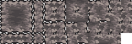

# Tile Gen
A simple Java project for generating tile variants for bit-masking.

- - -

**Raw image**: <br>
 <br>
**Processed image**: <br>
 <br>

- - -

### Using the Generator
- Grab the `TileGen.jar` file. You can either grab this from [releases](https://github.com/GlennFolker/TileGen/releases) or you can also compile this project yourself.
- Create your sprite:
  - The dimension size must be divisible by 4 and must be square.
  - Pixel scaling should be 1×1.
- Run `java -jar TileGen.jar [your-sprite].png`. This will generate a new processed sprite with the name as your raw sprite name suffixed with `-tiled`.

### Using the Processed Sprite
- Split your sprites into `sprites[47]` and map it as shown below: <br>
  
- Count the mask by using `mask |= 1 << index`; treat `index` as: <br>
  
- The sprite of the tile can be mapped from the `mask` by using `sprites[tiles[mask]]` assuming `tiles` is:
  ```
  new int[]{
      39, 36, 39, 36, 27, 16, 27, 24, 39, 36, 39, 36, 27, 16, 27, 24,
      38, 37, 38, 37, 17, 41, 17, 43, 38, 37, 38, 37, 26, 21, 26, 25,
      39, 36, 39, 36, 27, 16, 27, 24, 39, 36, 39, 36, 27, 16, 27, 24,
      38, 37, 38, 37, 17, 41, 17, 43, 38, 37, 38, 37, 26, 21, 26, 25,
       3,  4,  3,  4, 15, 40, 15, 20,  3,  4,  3,  4, 15, 40, 15, 20,
       5, 28,  5, 28, 29, 10, 29, 23,  5, 28,  5, 28, 31, 11, 31, 32,
       3,  4,  3,  4, 15, 40, 15, 20,  3,  4,  3,  4, 15, 40, 15, 20,
       2, 30,  2, 30,  9, 47,  9, 22,  2, 30,  2, 30, 14, 44, 14,  6,
      39, 36, 39, 36, 27, 16, 27, 24, 39, 36, 39, 36, 27, 16, 27, 24,
      38, 37, 38, 37, 17, 41, 17, 43, 38, 37, 38, 37, 26, 21, 26, 25,
      39, 36, 39, 36, 27, 16, 27, 24, 39, 36, 39, 36, 27, 16, 27, 24,
      38, 37, 38, 37, 17, 41, 17, 43, 38, 37, 38, 37, 26, 21, 26, 25,
       3,  0,  3,  0, 15, 42, 15, 12,  3,  0,  3,  0, 15, 42, 15, 12,
       5,  8,  5,  8, 29, 35, 29, 33,  5,  8,  5,  8, 31, 34, 31,  7,
       3,  0,  3,  0, 15, 42, 15, 12,  3,  0,  3,  0, 15, 42, 15, 12,
       2,  1,  2,  1,  9, 45,  9, 19,  2,  1,  2,  1, 14, 18, 14, 13
  };
  ```
